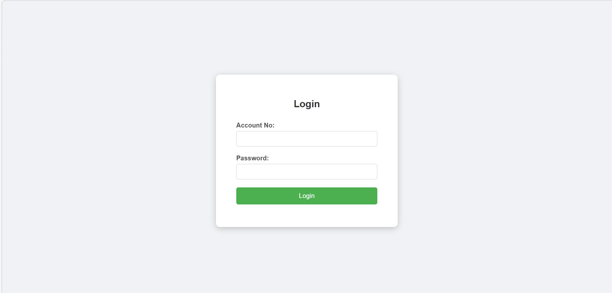
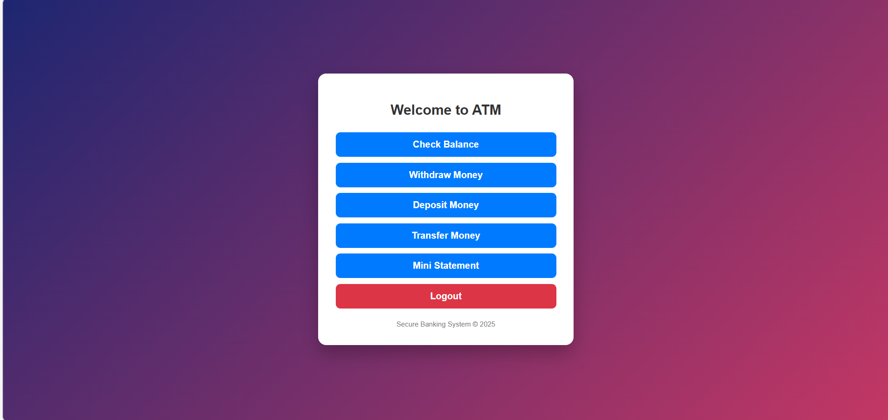
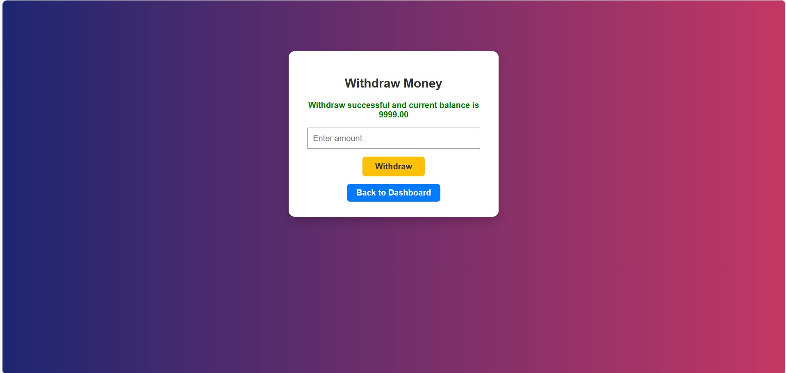
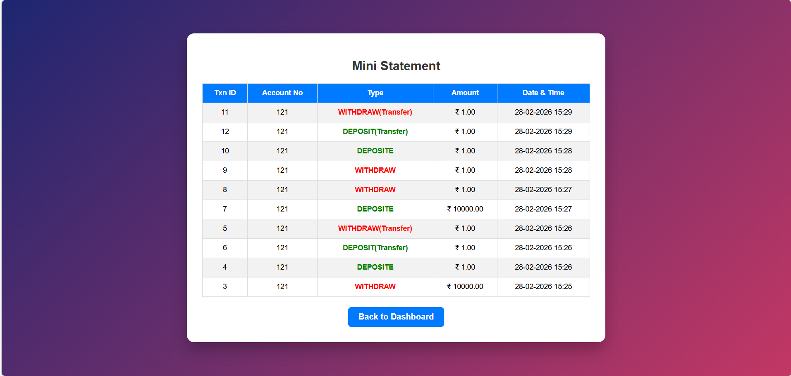
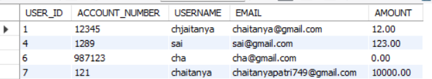

# 🏦 Full-Stack ATM Banking Application

A complete full-stack ATM Banking System built using **Python, Flask, MySQL, HTML, and CSS**.  
This project simulates real-world banking operations with proper database integration and transaction logging.

---

## 🚀 Features

- User Registration
- Secure Login System
- Session Management
- Check Account Balance
- Deposit Money
- Withdraw Money
- Transfer Money Between Accounts
- Mini Statement (Transaction History)
- Real-time Database Updates
- Parameterized Queries (SQL Injection Safe)

---

## 🛠️ Tech Stack

- Backend: Python, Flask
- Database: MySQL
- Frontend: HTML, CSS
- Database Connector: mysql-connector-python
- Version Control: Git

---

# 📸 Application Screenshots

---

## 🏠 Home Page


---

## 📝 Registration Page


---

## 🔐 Login Page



---

## 📊 Dashboard



---

## 💰 Check Balance


---

## ➖ Withdraw Money



---

## ➕ Deposit Money


---

## 🔄 Transfer Money


---

## 📑 Mini Statement

Displays transaction history including transaction type, amount, and timestamp.



---

# 🗄️ Database Design

---

## 👤 Users Table

Stores user account details and current balance.



---

## 💳 Transactions Table

Stores all transaction logs including deposits, withdrawals, and transfers.


---

# 📂 Project Structure

```
Full-Stack-ATM-Application/
│
├── app.py
├── database/
│   ├── databaseConnection.py
│   ├── utility.py
│   ├── transfer.py
│
├── templates/
├── static/
├── images/
│
└── README.md
```

---

# ⚙️ How to Run the Project

### 1️⃣ Clone Repository

```
git clone https://github.com/patri-chaitanya/Full-Stack-ATM-Application.git
cd Full-Stack-ATM-Application
```

### 2️⃣ Install Dependencies

```
pip install flask mysql-connector-python
```

### 3️⃣ Setup MySQL Database

- Create a new database
- Create `users` table
- Create `transactions` table
- Update database credentials in `databaseConnection.py`

### 4️⃣ Run Application

```
python app.py
```

Open browser:

```
http://127.0.0.1:5000/
```

---

# 🔐 Security Implementation

- Parameterized SQL Queries
- Exception Handling
- Input Validation
- Session-Based Authentication
- Transaction Logging

---

# 🎯 What This Project Demonstrates

- Full-stack development using Flask
- Backend architecture design
- Relational database integration
- Real-time transaction updates
- Error handling & debugging
- Clean UI implementation

---

# 👨‍💻 Author

**Patri Chaitanya**  
Aspiring Data Analyst / AI/ML Engineer  

---

⭐ If you found this project useful, feel free to give a star!
